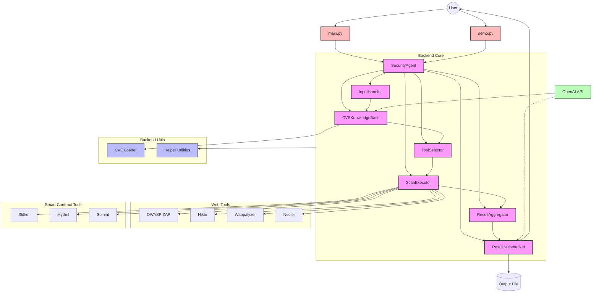

# Security AI Agent

A Security AI Agent for automating vulnerability assessments for websites and smart contracts.

## Features

- **Input Handling**: Accepts website URLs, Solidity smart contract code/repositories, or multiple files
- **CVE Knowledge Base**: Queries for known CVEs related to the target
- **Tool Selection**: Dynamically selects appropriate security tools based on the target type
- **Scan Execution**: Executes selected security tools against the target
- **Result Aggregation**: Merges and deduplicates results from multiple tools
- **Summary Generation**: Produces human-readable reports with remediation suggestions
- **Detailed Logging**: View comprehensive logs of tool execution and scan results
- **Multiple File Scanning**: Scan multiple files or entire directories at once
- **GitHub Repository Support**: Directly scan code from GitHub repositories

## Project Structure

This project follows industry best practices with a clean separation of backend and frontend components:

### Backend (`backend/`)

The backend is organized as a Python package with modular components:

- `backend/core/` - Core business logic and functionality
  - `security_agent.py` - Main Security Agent module
  - `input_handler.py` - Input validation and classification
  - `cve_knowledge_base.py` - CVE querying and analysis
  - `tool_selector.py` - Security tool selection
  - `scan_executor.py` - Tool execution (mocked for demo)
  - `result_aggregator.py` - Result aggregation and deduplication
  - `result_summarizer.py` - Report generation using LLMs

- `backend/utils/` - Helper utilities
  - `cve_loader.py` - CVE data loading utilities
  - `helpers.py` - Common utility functions

### Frontend (`frontend/`)

A React-based user interface for the security agent is planned for future development.

## Architecture Diagram



## Getting Started

1. Install Python dependencies:
   ```
   pip install -r requirements.txt
   ```

2. Set up environment variables:
   ```
   cp env.example .env
   ```
   Edit the `.env` file and add your OpenAI API key.

3. Run the security agent:
   ```
   python main.py scan https://example.com
   ```
   or
   ```
   python demo.py https://example.com
   ```

## Usage

### Command-line Interface

The main entry point provides several commands:

```
# Run a security scan on a website or Solidity contract
python main.py scan <target> [--format json|markdown] [--output-file results.json]

# Scan multiple files/URLs at once
python main.py scan file1.sol file2.sol file3.sol [--output-file results.json]

# Scan a directory recursively
python main.py scan src/ --recursive [--output-file results.json]

# Scan a GitHub repository
python main.py scan https://github.com/username/repository --repo [--output-file results.json]

# Scan a private GitHub repository (requires authentication)
python main.py scan https://github.com/username/repository --repo --token YOUR_GITHUB_TOKEN

# Load CVE data into the knowledge base
python main.py load-cve [--id CVE-ID] [--keyword search_term] [--smart-contracts]

# Run the legacy mode (RAG-based only, less features)
python main.py run <url> [--sample-data]
```

### Demo Script

A friendly demo interface is provided for easy usage:

```
# Basic usage - single target
python demo.py <target> [--output results.json] [--format json|markdown]

# Scan multiple files
python demo.py file1.sol file2.sol file3.sol [--output results.json]

# Scan a directory recursively
python demo.py src/ --recursive [--output results.json]

# Scan a GitHub repository
python demo.py --repo https://github.com/username/repository [--output results.json]

# With verbose logging enabled
python demo.py <target> --verbose
```

#### Multiple File Scanning

When scanning multiple files or repositories, the tool will:

1. Analyze each file individually
2. Aggregate findings across all files
3. Generate a comprehensive report that includes:
   - Per-file vulnerability counts
   - Overall severity summary
   - Consolidated remediation suggestions

Example scanning multiple files:
```
python demo.py contract1.sol contract2.sol --output results.json
```

#### GitHub Repository Scanning

Scan entire GitHub repositories by providing the repository URL:

```
python demo.py --repo https://github.com/username/repository
```

The agent will:
1. Access the repository through the GitHub API
2. Analyze all relevant files (Solidity contracts, web files, etc.)
3. Generate a comprehensive security report
4. Clean up temporary files automatically

For private repositories, you'll need to provide a GitHub access token:

```
python demo.py --repo https://github.com/username/repository --token YOUR_GITHUB_TOKEN
```

##### Handling GitHub API Rate Limits

When scanning large repositories, you may encounter GitHub API rate limits. The tool has been designed to:
- Process files in small batches
- Implement smart retries with exponential backoff
- Return partial results when possible

To avoid rate limiting issues:
- **Use a GitHub token** - Authenticated requests have higher rate limits
- **Scan smaller repositories** - Repositories with fewer files are less likely to hit limits
- **Avoid scanning multiple repositories in quick succession**

If a rate limit is hit, the tool will:
- Complete the scan with the files already downloaded
- Show a warning about the incomplete results
- Provide instructions for getting more complete results

You can [create a GitHub personal access token](https://github.com/settings/tokens) with `repo` scope to access private repositories and increase rate limits.

#### Recursive Directory Scanning

Scan all files in a directory structure:

```
python demo.py --recursive ./src
```

#### Verbose Mode

The `--verbose` (or `-v`) flag enables detailed logging of all tool execution steps and results:

- View API calls to OpenAI
- See detailed execution steps for each security tool
- Display all findings from each tool with full details
- Show raw output from security tools

Example:
```
python demo.py https://example.com --verbose
```

### Logging Configuration

Logging levels can be configured in the `.env` file:

```
# Log Level (DEBUG, INFO, WARNING, ERROR, CRITICAL)
LOG_LEVEL=DEBUG
```

## Example Output

The security agent produces detailed reports including:

- Overall security risk assessment
- Detailed vulnerability findings
- Technical analysis of detected issues
- Remediation suggestions for each vulnerability
- Complete tool execution results (when using `--verbose` mode)

## Note on Tool Execution

In the current demo version, security tool execution is simulated. In a production environment, actual tools like OWASP ZAP, Nikto, Wappalyzer (for websites) and Mythril, Slither (for Solidity contracts) would be integrated.

## Requirements

- Python 3.8+
- OpenAI API key (GPT-4 or GPT-4o-mini recommended)
- Python packages listed in requirements.txt