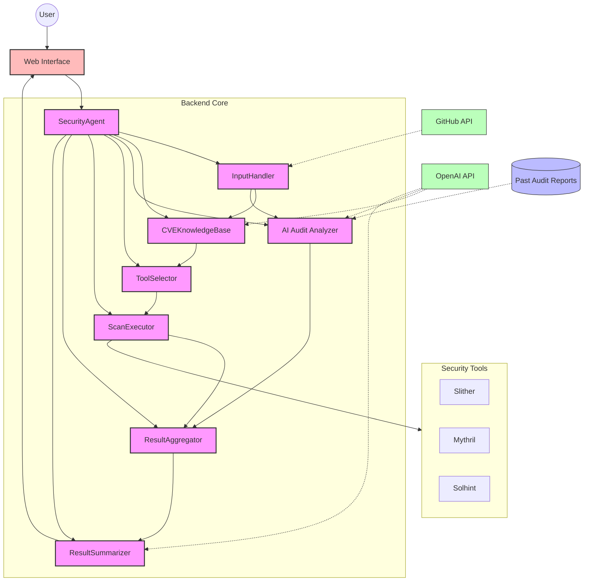

# Security AI Agent

A Security AI Agent for automating vulnerability assessments for websites and smart contracts.

## Features

- **Input Handling**: Accepts GitHub repository URLs or Solidity smart contract code
- **CVE Knowledge Base**: Queries for known CVEs related to the target
- **AI Audit Analyzer**: Advanced AI-powered Solidity code auditor that leverages knowledge from past audit reports
- **Tool Selection**: Dynamically selects appropriate security tools based on the target type
- **Scan Execution**: Executes selected security tools against the target
- **Result Aggregation**: Merges and deduplicates results from multiple tools
- **Summary Generation**: Produces human-readable reports with remediation suggestions
- **GitHub Repository Support**: Directly scan code from GitHub repositories
- **Web Interface**: User-friendly frontend for scanning and viewing results

## AI Audit Analyzer

The AI Audit Analyzer is a sophisticated component that uses GPT-4 to perform intelligent security audits on Solidity smart contracts. Key features include:

- **Knowledge-Based Analysis**: Leverages patterns and findings from past audit reports to enhance detection accuracy
- **Comprehensive Vulnerability Detection**: Identifies 10+ categories of vulnerabilities including:
  - Reentrancy vulnerabilities
  - Integer overflow/underflow
  - Access control issues
  - Unchecked return values
  - Gas optimization issues
  - Business logic issues
  - Oracle manipulation vulnerabilities
  - Front-running vulnerabilities
  - Denial of Service (DoS) vulnerabilities
- **Structured Output**: Provides detailed findings with severity levels, locations, and remediation recommendations
- **Pattern Recognition**: Automatically extracts and applies vulnerability patterns from historical audit data

## Quick Start

### Prerequisites

1. **OpenAI API Key**: Get your API key from [OpenAI](https://platform.openai.com/api-keys)
2. **GitHub Token** (optional): For private repositories or to avoid rate limits. Get it from [GitHub Settings](https://github.com/settings/tokens)

### Installation & Setup

1. **Create and activate a Python virtual environment** (recommended):
   ```bash
   # Create virtual environment
   python3 -m venv sec-agent-env
   
   # Activate virtual environment
   # On macOS/Linux:
   source sec-agent-env/bin/activate
   
   # On Windows:
   sec-agent-env\Scripts\activate
   ```

2. **Install dependencies**:
   ```bash
   pip install -r requirements.txt
   ```

3. **Start the backend server**:
   ```bash
   PORT=8080 GITHUB_TOKEN=your_github_token OPENAI_API_KEY=your_openai_key python -m api.server
   ```

4. **Start the frontend**:
   ```bash
   cd frontend
   npm start
   ```

5. **Open your browser** and navigate to `http://localhost:3000`

### Usage

1. Enter a GitHub repository URL in the input field
2. Optionally provide your GitHub token for private repositories
3. Click submit and wait for the scan to complete
4. View results organized by severity:
   - **Summary**: Executive summary and overall assessment
   - **Issues**: Security issues categorized by severity (High, Medium, Low, Info)
   - **Debug**: Raw response data for debugging

You can also paste Solidity code directly into the interface for analysis.

## Project Structure

### Backend (`backend/`)

- `backend/core/` - Core business logic and functionality
  - `security_agent.py` - Main Security Agent module
  - `input_handler.py` - Input validation and classification
  - `cve_knowledge_base.py` - CVE querying and analysis
  - `tool_selector.py` - Security tool selection
  - `scan_executor.py` - Tool execution
  - `result_aggregator.py` - Result aggregation and deduplication
  - `result_summarizer.py` - Report generation using LLMs

- `backend/utils/` - Helper utilities
  - `cve_loader.py` - CVE data loading utilities
  - `helpers.py` - Common utility functions

### Frontend (`frontend/`)

A React-based user interface for the security agent.

## Architecture Diagram



## Requirements

- Python 3.10.4
- Node.js 18+ (for frontend)
- OpenAI API key (GPT-4 or GPT-4o-mini recommended)
- GitHub token (optional, for private repositories)

## Advanced Configuration

### Environment Variables

Create a `.env` file in the project root:

```bash
OPENAI_API_KEY=your_openai_api_key
GITHUB_TOKEN=your_github_token
LOG_LEVEL=INFO
PORT=8080
```


## Example Output

The security agent produces detailed reports including:

- Overall security risk assessment
- Detailed vulnerability findings
- Technical analysis of detected issues
- Remediation suggestions for each vulnerability
- Severity-based categorization of issues

## Troubleshooting

- **Backend not starting**: Check that your OpenAI API key is valid and set correctly
- **GitHub scanning fails**: Ensure your GitHub token has the necessary permissions
- **Frontend not loading**: Make sure both backend (port 8080) and frontend (port 3000) are running

For more detailed information about GitHub scanning features, see [README-github-scanning.md](./README-github-scanning.md).
