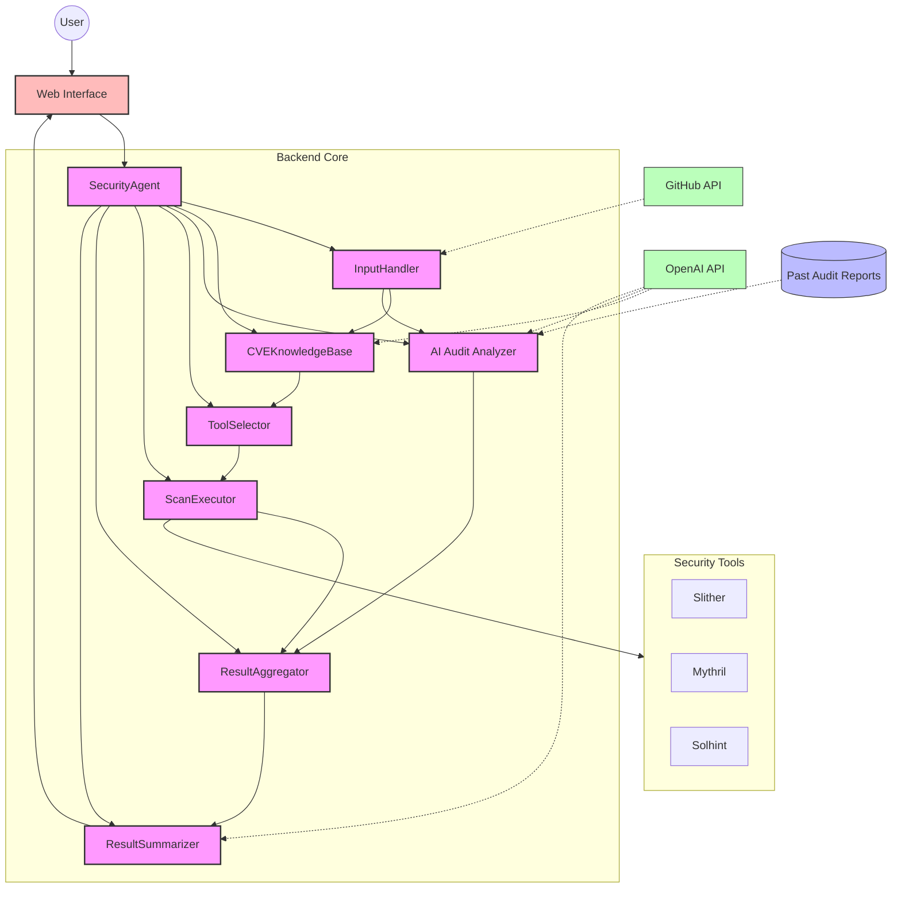

# Security AI Agent

A Security AI Agent for automating vulnerability assessments for websites and smart contracts.

## Features

- **Input Handling**: Accepts GitHub repository URLs or Solidity smart contract code
- **CVE Knowledge Base**: Queries for known CVEs related to the target
- **AI Audit Analyzer**: Advanced AI-powered Solidity code auditor that leverages knowledge from past audit reports
- **Tool Selection**: Dynamically selects appropriate security tools based on the target type
- **Scan Execution**: Executes selected security tools against the target
- **Result Aggregation**: Merges and deduplicates results from multiple tools
- **Summary Generation**: Produces human-readable reports with remediation suggestions
- **GitHub Repository Support**: Directly scan code from GitHub repositories
- **Web Interface**: User-friendly frontend for scanning and viewing results

## AI Audit Analyzer

The AI Audit Analyzer is a sophisticated component that uses GPT-4 to perform intelligent security audits on Solidity smart contracts. Key features include:

- **Knowledge-Based Analysis**: Leverages patterns and findings from past audit reports to enhance detection accuracy
- **Comprehensive Vulnerability Detection**: Identifies 10+ categories of vulnerabilities including:
  - Reentrancy vulnerabilities
  - Integer overflow/underflow
  - Access control issues
  - Unchecked return values
  - Gas optimization issues
  - Business logic issues
  - Oracle manipulation vulnerabilities
  - Front-running vulnerabilities
  - Denial of Service (DoS) vulnerabilities
- **Structured Output**: Provides detailed findings with severity levels, locations, and remediation recommendations
- **Pattern Recognition**: Automatically extracts and applies vulnerability patterns from historical audit data

## Quick Start

### Prerequisites

1. **Python 3.9+**: Required for the backend
2. **Node.js 18+**: Required for the frontend
3. **uv**: Fast Python package manager ([Installation Guide](https://github.com/astral-sh/uv))
4. **OpenAI API Key**: Get your API key from [OpenAI](https://platform.openai.com/api-keys)
5. **GitHub Token** (optional): For private repositories or to avoid rate limits. Get it from [GitHub Settings](https://github.com/settings/tokens)

### Installation & Setup

#### 1. Install UV (if not already installed)
```bash
# Install uv
curl -LsSf https://astral.sh/uv/install.sh | sh

# Add to PATH (restart shell or run):
source $HOME/.local/bin/env
```

#### 2. Clone and Setup Project
```bash
git clone <your-repo-url>
cd sec-agent
```

#### 3. Setup Python Backend with UV
```bash
# Create virtual environment
uv venv

# Activate virtual environment
source .venv/bin/activate

# Install dependencies (choose one based on your needs):
uv sync                    # Core dependencies only
uv sync --extra ai         # Core + AI features (recommended)
uv sync --extra security   # Core + security tools
uv sync --extra full       # Everything (AI + security + dev tools)
```

#### 4. Setup Frontend
```bash
cd frontend
npm install
cd ..
```

#### 5. Configure Environment Variables
Create a `.env` file in the project root:
```bash
OPENAI_API_KEY=your_openai_api_key
GITHUB_TOKEN=your_github_token  # Optional
LOG_LEVEL=INFO
PORT=8080
```

### Running the Application

#### Start Backend Server
```bash
# Make sure virtual environment is activated
source .venv/bin/activate

# Start the backend server (choose one):
uv run python -m backend.api.server
# OR
python backend/api/server.py
# OR
PORT=8080 GITHUB_TOKEN=your_github_token OPENAI_API_KEY=your_openai_key python -m backend.api.server
```

#### Start Frontend (in a new terminal)
```bash
cd frontend
npm start
```

#### Access the Application
1. **Frontend**: Open your browser and navigate to `http://localhost:3000`
2. **Backend API**: Available at `http://localhost:8080`
3. **API Status**: Check `http://localhost:8080/api/status`

### Usage

1. Enter a GitHub repository URL in the input field
2. Optionally provide your GitHub token for private repositories
3. Click submit and wait for the scan to complete
4. View results organized by severity:
   - **Summary**: Executive summary and overall assessment
   - **Issues**: Security issues categorized by severity (High, Medium, Low, Info)
   - **Debug**: Raw response data for debugging

You can also paste Solidity code directly into the interface for analysis.

## Project Structure

### Backend (`backend/`)

- `backend/core/` - Core business logic and functionality
  - `security_agent.py` - Main Security Agent module
  - `input_handler.py` - Input validation and classification
  - `cve_knowledge_base.py` - CVE querying and analysis
  - `tool_selector.py` - Security tool selection
  - `scan_executor.py` - Tool execution
  - `result_aggregator.py` - Result aggregation and deduplication
  - `result_summarizer.py` - Report generation using LLMs

- `backend/utils/` - Helper utilities
  - `cve_loader.py` - CVE data loading utilities
  - `helpers.py` - Common utility functions

### Frontend (`frontend/`)

A React-based user interface for the security agent.

## Architecture Diagram


```mermaid
flowchart TD
    %% Entry Points
    User((User)) --> WebInterface[Web Interface]

    %% Main Components
    WebInterface --> SecurityAgent

    %% Core modules
    subgraph BackendCore[Backend Core]
        SecurityAgent[SecurityAgent]
        InputHandler[InputHandler]
        CVEKnowledgeBase[CVEKnowledgeBase]
        AIAuditAnalyzer[AI Audit Analyzer]
        ToolSelector[ToolSelector]
        ScanExecutor[ScanExecutor]
        ResultAggregator[ResultAggregator]
        ResultSummarizer[ResultSummarizer]
    end

    %% Connections between core components
    SecurityAgent --> InputHandler
    SecurityAgent --> CVEKnowledgeBase
    SecurityAgent --> AIAuditAnalyzer
    SecurityAgent --> ToolSelector
    SecurityAgent --> ScanExecutor
    SecurityAgent --> ResultAggregator
    SecurityAgent --> ResultSummarizer

    %% Data flow
    InputHandler --> CVEKnowledgeBase
    InputHandler --> AIAuditAnalyzer
    CVEKnowledgeBase --> ToolSelector
    AIAuditAnalyzer --> ResultAggregator
    ToolSelector --> ScanExecutor
    ScanExecutor --> ResultAggregator
    ResultAggregator --> ResultSummarizer

    %% External Services
    OpenAI[OpenAI API]
    GitHub[GitHub API]
    AuditReports[(Past Audit Reports)]
    
    OpenAI -.-> CVEKnowledgeBase
    OpenAI -.-> AIAuditAnalyzer
    OpenAI -.-> ResultSummarizer
    GitHub -.-> InputHandler
    AuditReports -.-> AIAuditAnalyzer

    %% Security Tools
    subgraph SecurityTools[Security Tools]
        Slither[Slither]
        Mythril[Mythril]
        Solhint[Solhint]
    end

    ScanExecutor --> SecurityTools

    %% Result flow
    ResultSummarizer --> WebInterface

    %% Styling
    classDef core fill:#f9f,stroke:#333,stroke-width:2px;
    classDef external fill:#bfb,stroke:#333,stroke-width:1px;
    classDef entry fill:#fbb,stroke:#333,stroke-width:2px;
    classDef data fill:#bbf,stroke:#333,stroke-width:1px;

    class SecurityAgent,InputHandler,CVEKnowledgeBase,AIAuditAnalyzer,ToolSelector,ScanExecutor,ResultAggregator,ResultSummarizer core;
    class OpenAI,GitHub external;
    class WebInterface entry;
    class AuditReports data;
```

## Dependency Management with UV

This project uses [uv](https://github.com/astral-sh/uv) for fast Python package management. The dependencies are organized into groups:

- **Core**: Basic web framework, document processing, GitHub integration
- **ai**: OpenAI, LangChain, ChromaDB for AI-powered analysis  
- **security**: Slither analyzer and security tools
- **dev**: Testing, linting, and development tools
- **full**: All of the above

### Common UV Commands
```bash
# Install different dependency groups
uv sync --extra ai         # Recommended for most users
uv sync --extra security   # For security tool integration
uv sync --extra full       # Everything

# Add new dependencies
uv add requests            # Add to core dependencies
uv add --dev pytest       # Add development dependency

# Update dependencies
uv lock --upgrade          # Update lock file
uv sync                    # Sync updated dependencies

# Run commands without activating venv
uv run python -m backend.api.server
uv run pytest
```

For detailed UV usage, see `README-uv.md` or run `./scripts/uv-commands.sh` for a reference.

## Requirements

- Python 3.9+ (managed by uv)
- Node.js 18+ (for frontend)
- OpenAI API key (GPT-4 or GPT-4o-mini recommended)
- GitHub token (optional, for private repositories)

## Advanced Configuration

### Environment Variables

Create a `.env` file in the project root:

```bash
OPENAI_API_KEY=your_openai_api_key
GITHUB_TOKEN=your_github_token
LOG_LEVEL=INFO
PORT=8080
```

### Troubleshooting

#### UV and Virtual Environment Issues
```bash
# If UV is not found, ensure it's in your PATH
echo $PATH | grep -q "/.local/bin" || echo "Add ~/.local/bin to your PATH"

# Recreate virtual environment if corrupted
rm -rf .venv
uv venv
source .venv/bin/activate
uv sync --extra ai

# Check UV and Python versions
uv --version
uv python list
```

#### Dependency Conflicts
Some security tools have conflicting dependencies. Use separate environments:
```bash
# For Slither analysis
uv sync --extra security

# For other conflicting tools, create separate environments
uv venv --name mythril-env
uv pip install mythril
```

#### Backend Server Issues
```bash
# Check if backend is running
curl http://localhost:8080/api/status

# Run with debug logging
LOG_LEVEL=DEBUG uv run python -m backend.api.server

# Check port availability
lsof -i :8080
```

#### Frontend Issues
```bash
# Clear npm cache and reinstall
cd frontend
rm -rf node_modules package-lock.json
npm install

# Run on different port if 3000 is occupied
PORT=3001 npm start
```

## Example Output

The security agent produces detailed reports including:

- Overall security risk assessment
- Detailed vulnerability findings
- Technical analysis of detected issues
- Remediation suggestions for each vulnerability
- Severity-based categorization of issues

## Troubleshooting

- **Backend not starting**: Check that your OpenAI API key is valid and set correctly
- **GitHub scanning fails**: Ensure your GitHub token has the necessary permissions
- **Frontend not loading**: Make sure both backend (port 8080) and frontend (port 3000) are running

For more detailed information about GitHub scanning features, see [README-github-scanning.md](./README-github-scanning.md).
